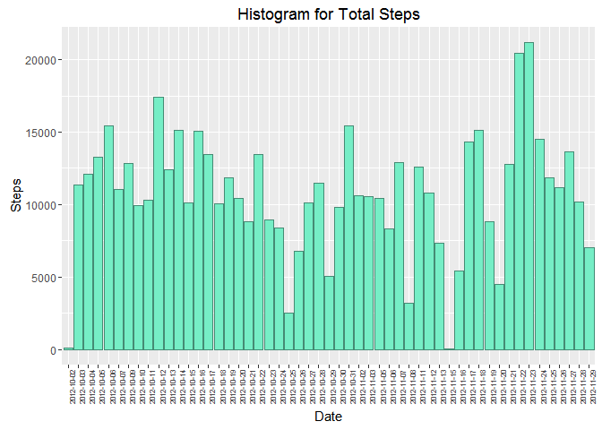
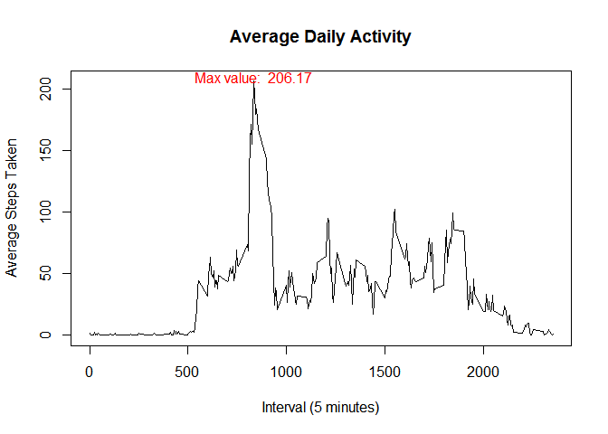
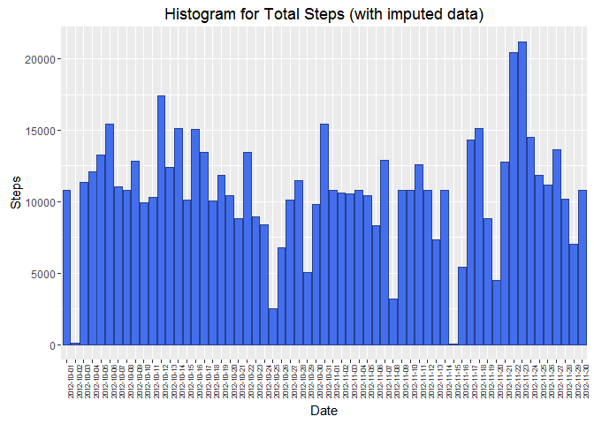
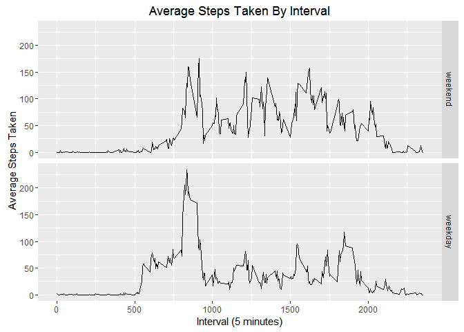

# Reproducible Research: Peer Assessment 1

## Loading and preprocessing the data
(Note: File "repdata_data_activity.zip" must be in the working directory)


```r
unzip("repdata_data_activity.zip")
data <- read.csv ("activity.csv")
data$date <- as.character(data$date, format="%Y-%m-%d")
```

## What is mean total number of steps taken per day?

```r
library(ggplot2)

steps_total <-aggregate(data$steps ~ data$date, FUN=sum, na.action = na.omit)
names(steps_total) <- c("date","steps")

ggplot(steps_total, aes(date, steps)) +
       geom_bar(stat="identity", fill="aquamarine2", color="aquamarine4") + 
       xlab("Date") + theme(axis.text.x = element_text(angle = 90, size = 6)) +
       ylab("Steps") +
     ggtitle("Histogram for Total Steps")
```

<!-- -->

### Mean and Median

```r
mean(steps_total$steps, na.rm=TRUE)
```

```
## [1] 10766.19
```

```r
median(steps_total$steps, na.rm=TRUE)
```

```
## [1] 10765
```

## What is the average daily activity pattern?

```r
avg_steps_by_interval <-aggregate(data$steps ~ data$interval, FUN=mean, na.action = na.omit)
names(avg_steps_by_interval) <- c("interval","avg_steps")
max_row <- which.max(avg_steps_by_interval$avg_steps)
max_value <- round(max(avg_steps_by_interval$avg_steps),digits=2)
with(avg_steps_by_interval, plot(interval, avg_steps, type = "l",
     main="Average Daily Activity",
     xlab="Interval (5 minutes)", ylab="Average Steps Taken"))
     text(x=avg_steps_by_interval$interval[max_row], y=max_value+4,
          paste("Max value: ", max_value), col="red")
```

<!-- -->

## Imputing missing values
There are several ways to impute missing values.  One method is to replace missing values
with an average value. I chose to use the average of the interval.

There are <span style="color:red"> 2304 </span> missing values in the data.

(Check out the cool na.aggregate function from the 'zoo' library!)


```r
library(zoo)
```

```
## 
## Attaching package: 'zoo'
```

```
## The following objects are masked from 'package:base':
## 
##     as.Date, as.Date.numeric
```

```r
full_data <- data
full_data$steps <- na.aggregate(full_data$steps, by=full_data$interval)

full_steps_total <-aggregate(full_data$steps ~ full_data$date, FUN=sum)
names(full_steps_total) <- c("date","steps")

ggplot(full_steps_total, aes(date, steps)) +
       geom_bar(stat="identity", fill="royalblue2", color="royalblue4") + 
       xlab("Date") + theme(axis.text.x = element_text(angle = 90, size = 6)) +
       ylab("Steps") +
       ggtitle("Histogram for Total Steps (with imputed data)")
```

<!-- -->

### Mean and Median

```r
mean(full_steps_total$steps, na.rm=TRUE)
```

```
## [1] 10766.19
```

```r
median(full_steps_total$steps, na.rm=TRUE)
```

```
## [1] 10766.19
```
Note: There is little difference between imputing the average interval value and removing missing values.

## Are there differences in activity patterns between weekdays and weekends?

```r
data$DOW <- weekdays(as.POSIXct(data$date))

weekend <- subset(data, DOW %in% c("Saturday", "Sunday"))
weekday <- subset(data, DOW %in% c("Monday", "Tuesday", "Wednesday", "Thursday", "Friday"))

weekend <- cbind(weekend, "day_type" = c(rep("weekend", nrow(weekend))))
weekday <- cbind(weekday, "day_type" = c(rep("weekday", nrow(weekday))))

merged_data <- rbind(weekend, weekday)
avg_by_interval <-aggregate(merged_data$steps ~ merged_data$interval+merged_data$day_type,
                            FUN=mean, na.action = na.omit)
names(avg_by_interval) <- c("interval", "day_type", "steps")

ggplot(avg_by_interval,aes(interval, steps)) +
       geom_line() +
       facet_grid(day_type ~ .) +
       xlab("Interval (5 minutes)") +
       ylab("Average Steps Taken") +
       ggtitle("Average Steps Taken By Interval")
```

<!-- -->
